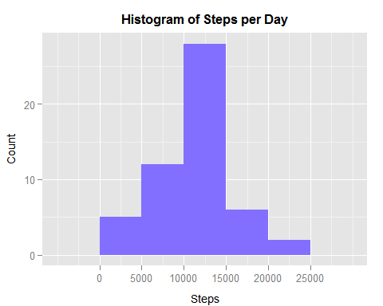
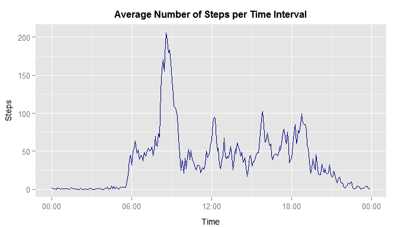
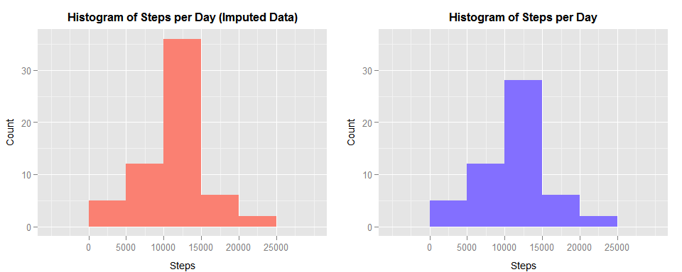
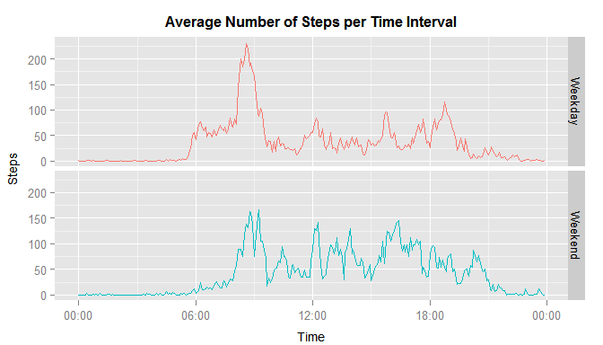

# Reproducible Research: Peer Assessment 1

<br>This data is from a personal activity monitoring device (i.e. Fitbit, Nike Fuelband, Jawbone Up) collected from an anonymous individual during the months of October and November, 2012 and include the number of steps taken in 5 minute intervals each day.


<br>

### Loading and preprocessing the data

The variables included in this dataset are:

    steps: Number of steps taking in a 5-minute interval (missing values are coded as NA)
    date: The date on which the measurement was taken in YYYY-MM-DD format
    interval: Identifier for the 5-minute interval in which measurement was taken

The dataset is stored in a comma-separated-value (CSV) file and there are a total of 17,568 observations in this dataset. Here the data is loaded into a data.frame


```r
activity <- read.csv("activity.csv", stringsAsFactors=FALSE)
activity$date <- as.Date(activity$date, format="%Y-%m-%d")
head(activity)
```

```
##   steps       date interval
## 1    NA 2012-10-01        0
## 2    NA 2012-10-01        5
## 3    NA 2012-10-01       10
## 4    NA 2012-10-01       15
## 5    NA 2012-10-01       20
## 6    NA 2012-10-01       25
```
<br><br>

### What is the mean total number of steps taken per day (ignoring NA values)?

Calculate the sum of steps over all sampling intervals for each date.


```r
totals <- aggregate(steps ~ date, data=activity, FUN=sum)
head(totals)
```

```
##         date steps
## 1 2012-10-02   126
## 2 2012-10-03 11352
## 3 2012-10-04 12116
## 4 2012-10-05 13294
## 5 2012-10-06 15420
## 6 2012-10-07 11015
```

```r
stats <- summary(totals$steps)
stats
```

```
##    Min. 1st Qu.  Median    Mean 3rd Qu.    Max. 
##      41    8841   10760   10770   13290   21190
```

<br>The mean is 10770, and the median is 10760. Here is a histogram of the results.


```r
tickValues <- pretty(totals$steps)
tickSpacing <- (tail(tickValues, n=1) - tickValues[1]) / (length(tickValues) - 1)
plot1 <- ggplot(totals[!is.na(totals$steps),], aes(x=steps)) + 
         geom_histogram(binwidth=tickSpacing, fill="slateblue1") + 
         scale_x_continuous(breaks=tickValues) +
         xlab("Steps") + 
         ylab("Count") + 
         ggtitle("Histogram of Steps per Day") +
         theme(plot.title=element_text(face="bold", size=rel(1), vjust=1.3), 
               axis.title.x=element_text(size=rel(0.9), vjust=-0.5), 
               axis.title.y=element_text(size=rel(0.9), vjust=1.2))
plot1
```

 
<br><br>

### What is the average daily activity pattern?

Calculate the mean number of steps for each sampling interval over all dates.


```r
means <- aggregate(steps ~ interval, data=activity, FUN=mean)
maxSteps <- means[which.max(means$steps),]
maxSteps
```

```
##     interval    steps
## 104      835 206.1698
```

<br>The time interval 835 (08:35) shows the greatest average number of steps to be approximately 206.17. Here is a plot of the complete distribution.


```r
means$time <- with(means, as.POSIXct(sprintf("%02d:%02d", 
                   trunc(interval / 100), interval %% 100), format="%H:%M"))
ggplot(means, aes(x=time, y=steps)) + 
        geom_line(color="navyblue") + 
        scale_x_datetime(labels=date_format("%H:%M")) + 
        xlab("Time") + 
        ylab("Steps") + 
        ggtitle("Average Number of Steps per Time Interval") +
        theme(plot.title=element_text(face="bold", size=rel(1), vjust=1.3), 
              axis.title.x=element_text(size=rel(0.9), vjust=-0.5), 
              axis.title.y=element_text(size=rel(0.9), vjust=1.2))
```

 
<br><br>

### Imputing missing values

Calculate the number of rows containing missing values in this dataset.


```r
missingValues <- sapply(activity, FUN=function(x) { sum(is.na(x)) })
print(missingValues)
```

```
##    steps     date interval 
##     2304        0        0
```

<br>The number of rows containing missing values is 2304. All missing values appear in the "steps" field. The presence of missing values may introduce bias into some calculations or summaries of the data. Previously calculated mean number of steps across all days sampled for the corresponding time interval will be substituted for these missing values.


```r
activityImpute <- activity
for(i in which(is.na(activity$steps))) {
        j <- which(means$interval == activityImpute$interval[i])
        activityImpute$steps[i] <- round(means$steps[j])
}
```

<br>Calculate the sum of steps over all sampling intervals for each date using the imputed data.


```r
totalsImpute <- aggregate(steps ~ date, data=activityImpute, FUN=sum)
statsImpute <- summary(totalsImpute$steps)
statsImpute
```

```
##    Min. 1st Qu.  Median    Mean 3rd Qu.    Max. 
##      41    9819   10760   10770   12810   21190
```

<br>The mean is 10770, and the median is 10760. These values differ negligibly from the mean and median calculated with the missing data omitted. Because the mean and median of the un-imputed data are nearly equal, filling in the missing data using the mean of the corresponding sampling interval narrows the distribution of total steps per day but does not significantly change the mean and median. Histograms of the imputed data (left) and the original data with NA values omitted (right) are shown below.


```r
plot2 <- ggplot(totalsImpute, aes(x=steps)) + 
         geom_histogram(binwidth=tickSpacing, fill="salmon") + 
         scale_x_continuous(breaks=tickValues) +
         xlab("Steps") + 
         ylab("Count") + 
         ggtitle("Histogram of Steps per Day (Imputed Data)") +
         theme(plot.title=element_text(face="bold", size=rel(1), vjust=1.3), 
               axis.title.x=element_text(size=rel(0.9), vjust=-0.5), 
               axis.title.y=element_text(size=rel(0.9), vjust=1.2))
yRange <- ggplot_build(plot2)$panel$ranges[[1]]$y.range
grid.arrange(plot2, plot1 + coord_cartesian(ylim=yRange), nrow=1, ncol=2)
```

 
<br><br>

### Are there differences in activity patterns between weekdays and weekends?

A new factor variable "day_type" will distinguish Weekdays and weekends.


```r
isWeekend <- weekdays(activityImpute$date) %in% c("Saturday", "Sunday")
activityImpute$day_type <- factor(isWeekend, labels=c("Weekday", "Weekend"))
head(unique(activityImpute[, c("date", "day_type")]))
```

```
##            date day_type
## 1    2012-10-01  Weekday
## 289  2012-10-02  Weekday
## 577  2012-10-03  Weekday
## 865  2012-10-04  Weekday
## 1153 2012-10-05  Weekday
## 1441 2012-10-06  Weekend
```

<br>Calculate the mean number of steps for each sampling interval over all dates for weekdays versus weekends.


```r
meansImpute <- aggregate(steps ~ interval + day_type, data=activityImpute, FUN=mean)
meansImpute$time <- with(meansImpute, as.POSIXct(sprintf("%02d:%02d", 
                        trunc(interval / 100), interval %% 100), format="%H:%M"))
ggplot(meansImpute, aes(x=time, y=steps, color=day_type)) + 
       geom_line() + 
       facet_grid(day_type ~ .) +
       scale_x_datetime(labels=date_format("%H:%M")) + 
       xlab("Time") + 
       ylab("Steps") + 
       ggtitle("Average Number of Steps per Time Interval") +
       theme(plot.title=element_text(face="bold", size=rel(1), vjust=1.3), 
             axis.title.x=element_text(size=rel(0.9), vjust=-0.5), 
             axis.title.y=element_text(size=rel(0.9), vjust=1.2), 
             legend.position="none")
```

 

<br>The mean number of steps on weekdays seems to exhibit clear local maxima in the morning and the evening, possibly corresponding to the subject's travel to and from work. On weekends, activity levels appear to be more uniform over the course of normal waking hours.

